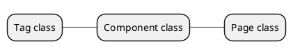

# Developer Guide

## Applications

All PuePy projects, even ones that define only one page, have an Application instance. If you want to use client-side
routing, you can define multiple pages for each application. Pages can be routed using HTML5 history mode (
ie, `/my/page`), using anchor hashes appended to the end of the URL (ie, `/index.html#/my/page`), or "direct" linking
mode, which triggers a page load on each navigation and assumes the server can route the page correctly.

## Core classes

All tags, even regular `t.span()` tags, are instances of the `puepy.Tag` class. The Component class, which adds
reactivity, props, custom events, and slots, inherits from `Tag`. `Page` inherits from `Component`, adding additional
features relevant for a "page" being rendered on the browser. Multiple tags and components can be rendered on one page,
but only one page is active at a time.

